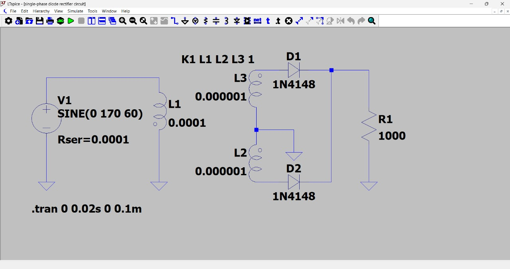
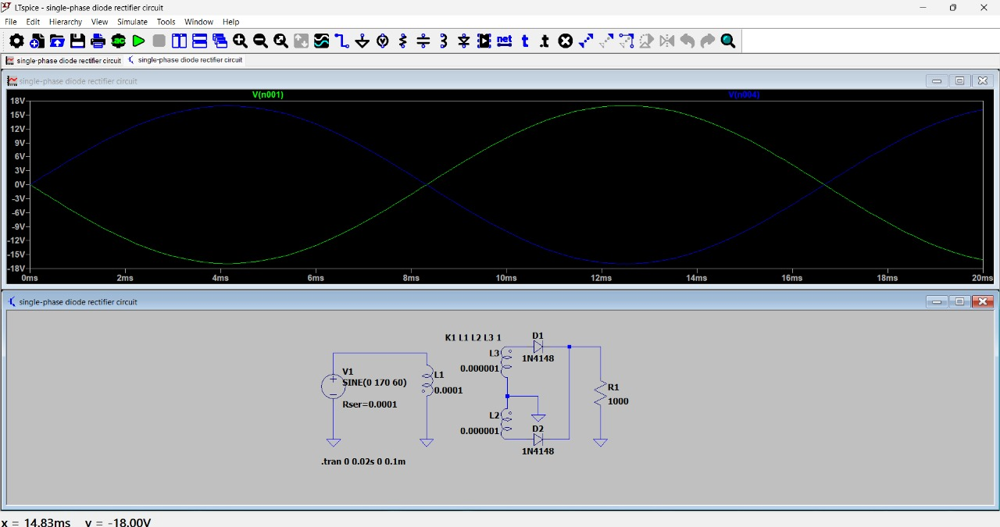
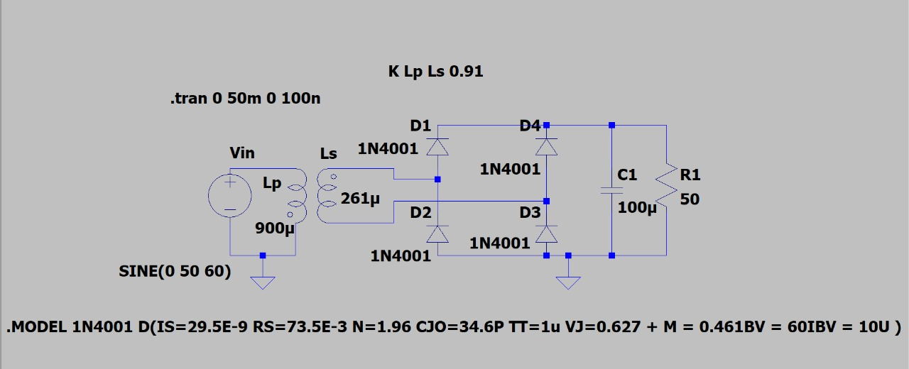
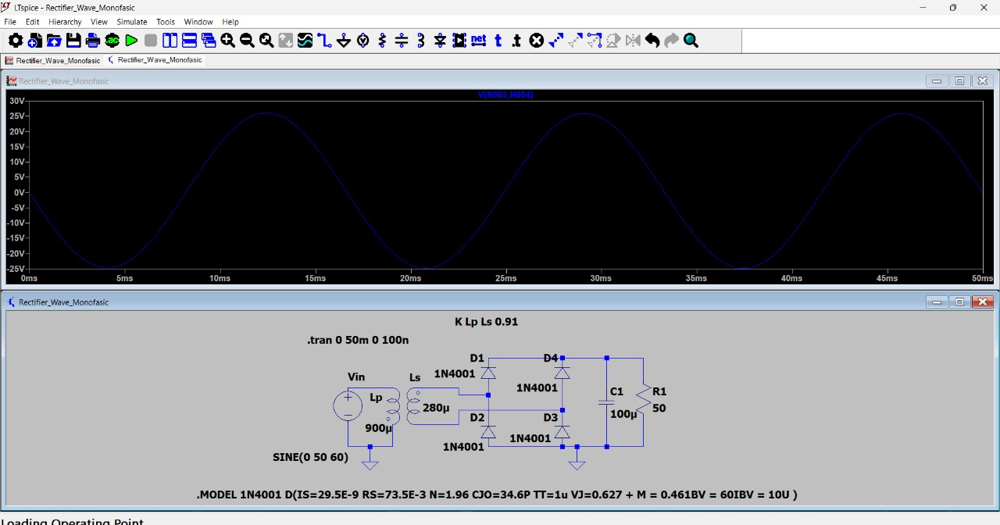
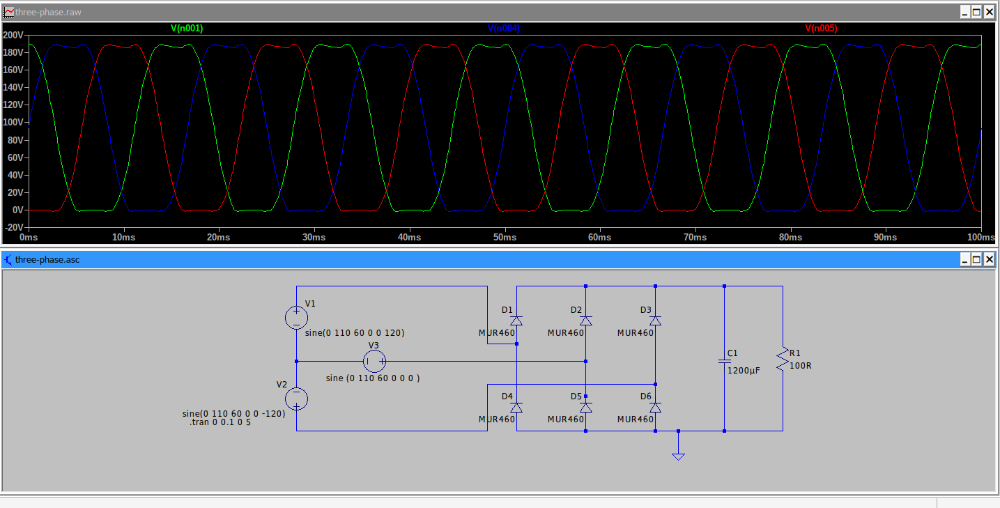
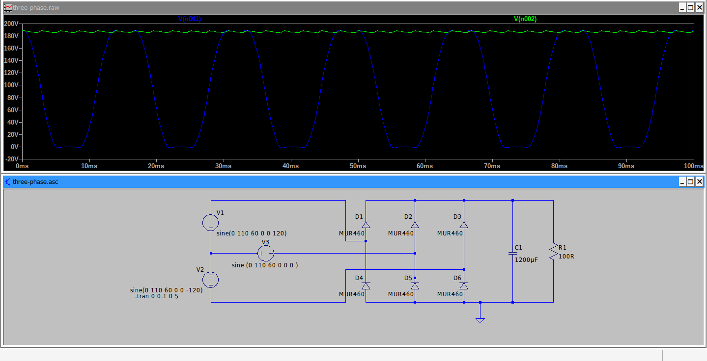

# Module 1: Diodes

# DIODE CHARACTERISTICS

It´s a two-terminal pn-junctions device. When the potential between anode and cathode is positive taking the anode like the reference point, the diode is forward biased and conducts, in this moment the diode has a relatively small forward voltage drop across it. In other case, when the potential between anode and cathode is negative taking the anode like the reference point, the diode is reverse biased, in this situation a small reverse current (leakage current) flows and that current increases slowly in magnitude with the reverse voltage. This behavior can be observed in this image

<b>Fig. 1.</b> Typical current-voltage (I-V) characteristic curve of a diode.

And can be describe by the equation knows as Shockley diode equation

$$
I_D = I_S \left( e^{\frac{V_D}{n V_T}} - 1 \right)
$$

Where:

$I_D$ = Current through the diode, A

$V_D$ = Diode voltage with anode positive with respect to cathode, V

$I_S$ = Leakage current, typically in the range $10^{-6}$ A to $10^{-15}$ A

$n$ = empirical constant knowns as emission coefficient,  usually whose value varies from 1 to 2

The diode characteristic can be divided into three regions : 

- Forward-biased	region,	where	$V_D > 0$
- Reverse-biased	region,	where	$V_D < 0$
- Breakdown region,	where	$V_D < -V_{BR}$

# DIODE TYPES 
|Diode|Voltage range|Current range|Reverse recovery time|Applications| 
|---|---|---|---|---|
|General-purpose|50 V to 5 kV|0A to several thousands|25 $\mu\text{S}$ |Diode rectifier, converters for a low-input frequency up to 1 kHz, line-commutated converters|
|Fast-recovery|50 V to 3 kV|0A to hundreds of amperes|5 $\mu\text{S}$|DC-DC and DC-AC converter circuits|
|Schottky|0 V to 100 V| 1 A to 400 A|10 $n\text{S}$|High-current and low-voltage DC power supplies|

# FREEWHEELING

the freewheeling diode (Dm) provides a safe path for the inductive current when the switch opens, preventing high voltage spikes and protecting the switch from damage

<b>Fig. 2.</b> Example of a freewheeling diode protecting a switch from inductive load voltage spikes.

# RECTIFIERS WITH DIODES

## single-phase (full wave)

<b>Fig. 3.</b> Schematic of a single-phase full-wave rectifier using a center-tapped transformer.

A single-phase full-wave rectifier converts both the positive and negative halves of an AC voltage into a pulsating DC voltage. It uses a center-tapped transformer and two diodes. During the positive half-cycle, one diode conducts; during the negative half-cycle, the other does. This allows current to flow through the load in the same direction during both halves of the cycle. The result is a more efficient and smoother DC output compared to a half-wave rectifier.

## Three phases

<b>Fig. 4.</b> Diagram of a three-phase bridge rectifier circuit.

A three-phase bridge rectifier uses six diodes to convert AC to DC in high-power applications. Two diodes conduct at a time, based on the highest line-to-line voltage, and each diode conducts for 120°. It produces a six-pulse DC output with lower ripple and works with or without a transformer

# PERFORMANCE PARAMETERS

- The average value of the output (load) voltage, $ V_dc $
- The average value of the output (load) current, $I_dc$
- The output dc power: $P_dc = V_dc I_dc$
- The root-mean-square (rms) value of the output voltage, $ V_rms $
- The rms value of the output current, $I_rms$
- The output AC power: $P_ac = V_rms * I_rms$
- The efficiency of a rectifier: $ n = P_dc/P_ac$

# DESIGN OF A RECTIFIER CIRCUIT

To design a rectifier circuit, diode arrangements are used that vary according to the complexity and whether the circuit is single-phase or three-phase. 

Below are examples from simulations:

## Single-phase rectifier circuit in LTspice

The following images show two typical single-phase rectifier configurations simulated in LTspice: the center-tapped rectifier with two diodes and the full-wave bridge rectifier with four diodes.

For the center-tapped rectifier, the first image shows the LTspice schematic using two diodes and a center-tapped transformer. The next image displays the input voltage waveform applied to the circuit, and the third image shows the output voltage waveform, which is a pulsating DC signal after rectification.

[LtSpice File](https://github.com/TobiasLozano/power-electronics-upb/blob/main/Module%201%20Diodes/simulation_files/single-phase%20diode%20rectifier%20circuit.asc)

<!-- Center-tapped single-phase rectifier (2 diodes) -->

<b>Fig. 5.</b> Center-tapped rectifier schematic.

<b>Fig. 6.</b> Input voltage waveform.

<b>Fig. 7.</b> Output voltage waveform.

The next set of images corresponds to the full-wave bridge rectifier. The first image shows the complete circuit, where a sinusoidal AC source is connected to a diode bridge (four diodes) and a load resistor. The following images present the input and output voltage waveforms. The output waveform demonstrates the rectified signal, which is a series of positive pulses with a peak voltage slightly below the input peak voltage due to diode forward voltage drops.

[LtSpice FIle](https://github.com/TobiasLozano/power-electronics-upb/blob/main/Module%201%20Diodes/simulation_files/Bridge_Rectifier_Circuit.asc)

<!-- Bridge rectifier (4 diodes) -->

<b>Fig. 8.</b> Complete circuit of a full-wave bridge rectifier

A sinusoidal AC source is connected to a diode bridge (four diodes) and a 1 kΩ load resistor. This configuration allows current to flow through the load in the same direction during both half-cycles of the input.

<b>Fig. 9.</b> Time-domain simulation of the bridge rectifier circuit input: the blue trace shows the 24 V, 60 Hz sinusoidal AC voltage source before rectification.

<b>Fig. 10.</b> Output (green) and input (blue) voltage waveforms for the bridge rectifier.

 The output is fully rectified, with both half-cycles positive and a peak near 22.6 V due to diode drops. The output shows significant ripple since no filter capacitor is used. 

## Three-phase rectifier circuit in LTspice using MUR460 diodes

[LtSpice File](https://github.com/TobiasLozano/power-electronics-upb/blob/main/Module%201%20Diodes/simulation_files/three-phase.asc)

<b>Fig. 5.</b> LTspice simulation schematic for a three-phase rectifier using MUR460 diodes.

- **Input signal:** shows the three voltage sources with the respective phase shift.

<b>Fig. 6.</b> Simulated three-phase input voltages showing phase displacement.

- **Output signal with ripple voltage:** result of rectification without filtering.

<b>Fig. 7.</b> Output voltage of the three-phase rectifier without filtering, showing ripple.

- **Output signal with 1200 uF capacitor:** result after adding a 1200 uF capacitor, showing a nearly DC voltage.

<b>Fig. 8.</b> Output voltage after filtering with a 1200 uF capacitor, showing reduced ripple and nearly DC voltage.

# Video presentation
[Module 1 - Diodes](https://www.youtube.com/watch?v=y_f7jPOzHwA)
# REFERENCES

[1] M. H. Rashid, *Power Electronics Handbook*, 4th ed. Burlington, MA, USA: Butterworth-Heinemann, 2018. [Online]. Available: https://uodiyala.edu.iq/uploads/PDF%20ELIBRARY%20UODIYALA/EL23/RASHID_Power_Electronics_Handbook.pdf

[2] Vishay Intertechnology, Inc., "1N4148 - Small Signal Fast Switching Diode," Datasheet, 2016. [Online]. Available: https://www.vishay.com/docs/81857/1n4148.pdf

[3] Vishay Intertechnology, Inc., 1N4001–1N4007 General Purpose Plastic Rectifier, Datasheet, Rev. 11-Feb-2021. [En línea]. Disponible en: https://www.vishay.com/docs/88503/1n4001.pdf

[4] Vishay Intertechnology, Inc., "MUR440-E3 - Ultrafast Rectifier," Datasheet, 2014. [Online]. Available: https://www.vishay.com/docs/88686/mur440-e3.pdf

