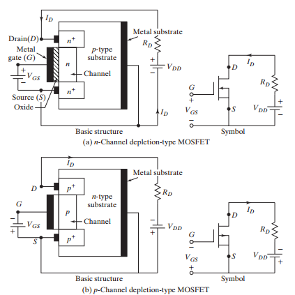
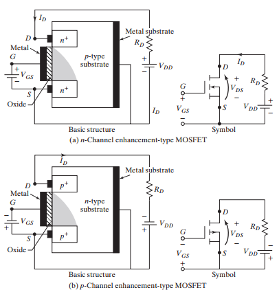
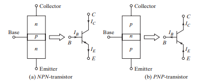

# Module 2: Power Transistor

Power transistors are semiconductor devices designed to handle high levels of voltage and current, mainly used as electronic switches in power conversion systems such as dc–dc and dc–ac converters. They operate in saturation mode to minimize on-state voltage drop and provide fast switching, although their ratings are generally lower than those of thyristors

In this module, the emphasis is:

- Power MOSFETs.
- Power BJTs 

## Power MOSFETs

A power MOSFET is a voltage-controlled device that requires little input current and offers very high switching speeds (nanoseconds), making it ideal for low-power, high-frequency converters. Unlike BJTs, it is free from second breakdown issues but is sensitive to electrostatic discharge and harder to protect under short-circuit conditions.

There are two main types:

- Depletion MOSFETs: Already conductive at zero gate voltage. A negative gate-to-source voltage depletes the channel, - increasing resistance and eventually stopping current (at pinch-off voltage). A positive voltage widens the channel, lowering resistance.

- Enhancement MOSFETs: Non-conductive at zero gate voltage. A positive gate-to-source voltage above the threshold voltage creates a channel that allows current flow.

Since depletion MOSFETs are normally ON and enhancement MOSFETs are normally OFF, enhancement-type MOSFETs are preferred in power electronics switching applications. To reduce resistance and allow higher current conduction, vertical (V-type) MOSFET structures are commonly used

## Power BJTs

A BJT (Bipolar Junction Transistor) is formed by combining two pn-junctions, creating NPN or PNP types. It has three terminals: collector, emitter, and base. With a wide emitter, narrow base, and doped collector, it provides efficient current conduction and a low on-state resistance, making it useful in power applications.

Simulation.