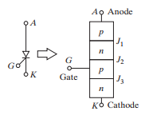
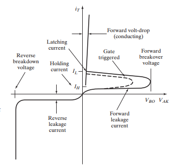

# Module 4: Thyristors

A thyristor is a solid-state semiconductor device widely used in power electronics to control and convert electrical energy. It operates as a bistable switch, meaning it stays off until a gate signal triggers it on, and then remains conducting until the current naturally drops to zero or is externally forced off. Conventional thyristors are mainly used for rectification and power control in high-voltage and high-current applications, while advanced types like Gate Turn-Off Thyristors (GTOs) allow both turn-on and turn-off through gate control. Thyristors are valued for their high power-handling capability and low conduction losses, making them especially useful in industrial drives, HVDC transmission, and other high-power systems.

## Thyristors characteristics 

The main characteristics of thyristors are: 

- Four-layer PNPN structure: consists of three PN junctions (J1, J2, J3) and three terminals: anode, cathode, gate

<em>Figure 1. Thyristor symbol.</em>

- Operating states: Forward blocking (off-state), Forward conducting (on-state), Reverse blocking state
- Latching current (IL): minimum anode current required to keep the thyristor conducting immediately after it has been turned on
- Holding current (IH): minimum anode current needed to sustain conduction. If current falls below IH, the device switches back to the blocking state (IH < IL)

<em>Figure 2. V-I Characteristics.</em>

- Voltage and current ratings: designed for high voltage blocking (hundreds to thousands of volts) and high current carrying capability

## Thyristor types

- Phase-controlled thyristors (or SCRs)
- Bidirectional phase-controlled thyristors (BCTs)
- Fast switching asymmetrical thyristors (or ASCRs)
- Light-activated silicon-controlled rectifiers (LASCRs)
- Bidirectional triode thyristors (TRIACs)
- Reverse-conducting thyristors (RCTs)
- Gate turn-off thyristors (GTOs)
- FET-controlled thyristors (FET-CTHs)
- MOS turn-off thyristors (MTOs)
- Emitter turn-off (control) thyristors (ETOs)
- Integrated gate-commutated thyristors (IGCTs)
- MOS-controlled thyristors (MCTs)
- Static induction thyristors (SITHs)

A comparation table between the previous thyristors:

| **Type of Thyristor** | **Control / Structure** | **Key Features** | **Typical Applications** |
|-------------------------|--------------------------|------------------|--------------------------|
| **Phase-controlled thyristor (SCR)** | 3 terminals (Anode, Cathode, Gate) | Classical thyristor, gate-controlled turn-on only, turn-off by current zero crossing | Power rectifiers, AC/DC converters, motor drives |
| **Bidirectional phase-controlled thyristor (BCT)** | Combines two SCRs in anti-parallel on one chip | Conducts in both directions, reduces device count | AC power control, induction heating |
| **Fast switching asymmetrical thyristor (ASCR)** | Asymmetrical voltage blocking capability | High-speed switching, optimized for low switching losses | High-frequency inverters, choppers |
| **Light-activated SCR (LASCR)** | Triggered by light instead of gate current | Optical isolation, suitable for high-voltage applications | HVDC transmission, pulsed power systems |
| **Bidirectional triode thyristor (TRIAC)** | Equivalent to two SCRs in anti-parallel with one gate | Can switch both half-cycles of AC with one gate | Lamp dimmers, AC motor control, household appliances |
| **Reverse-conducting thyristor (RCT)** | SCR with built-in anti-parallel diode | Eliminates need for external diode, saves space | Inverters, motor drives |
| **Gate turn-off thyristor (GTO)** | Gate controls both turn-on and turn-off | High power capability, requires large gate current for turn-off | Traction, industrial drives, HVDC systems |
| **FET-controlled thyristor (FET-CTH)** | Combines FET and thyristor | Easier gate control, voltage-controlled operation | Power electronics where simpler control is needed |
| **MOS turn-off thyristor (MTO)** | Combines MOSFET with thyristor | MOSFET helps in controlled turn-off, improved efficiency | Medium-to-high power converters |
| **Emitter turn-off thyristor (ETO)** | Uses auxiliary MOSFETs in the emitter path | Very fast turn-off, low switching losses | Pulsed power, high-frequency power converters |
| **Integrated gate-commutated thyristor (IGCT)** | Improved GTO with integrated gate drive | Very high power, fast turn-off, low conduction losses | FACTS, HVDC, medium-voltage drives |
| **MOS-controlled thyristor (MCT)** | MOSFET structure embedded in thyristor | Full gate-controlled turn-on and turn-off, low gate power | Motor drives, inverters, DC/DC converters |
| **Static induction thyristor (SITH)** | Vertical-channel FET-like structure | Very fast switching, low on-state voltage, high-frequency | RF amplifiers, pulsed power, high-speed inverters |

