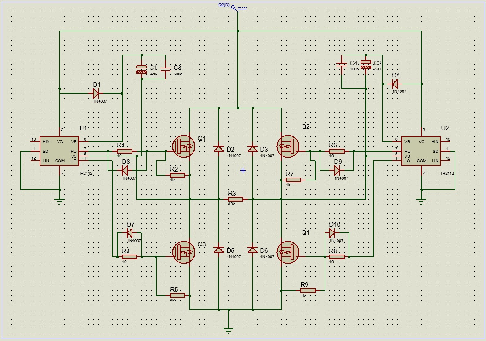

# Module 6 – Single-Phase Full-Bridge Inverter

**Power Electronics Laboratory**  


# 1. Theoretical Background

A single-phase full-bridge inverter converts a DC input into an AC output by commutating four controlled switches arranged in an H-bridge configuration. This topology allows the output voltage to take the values \(+V_{dc}\), \(0\), and \(-V_{dc}\), which enables bipolar AC synthesis with high efficiency and controllability. Its widespread use is attributed to its simplicity, robustness, and compatibility with various modulation strategies (Rashid, 2017).

In this project, the inverter output is shaped using Sinusoidal Pulse-Width Modulation (SPWM). In SPWM, the duty cycle of a high-frequency carrier is varied according to a sinusoidal reference. As a result, the average value of the switching pulses over each carrier cycle approximates a sine wave. The fundamental output frequency depends on the SPWM pattern timing, while harmonic content is primarily determined by the switching frequency.

The Arduino Uno generates two complementary SPWM signals that define the positive and negative half-cycles of the inverter output. These signals are applied to two IR2110 high- and low-side driver ICs, which provide the necessary gate voltages and level shifting for the N-channel MOSFETs used in the H-bridge. The IR2110 enables the high-side switches by means of a bootstrap circuit, ensuring that the gate voltage remains above the source potential during conduction.

The output was connected directly to the load without filtering. Therefore, the resulting AC waveform corresponds to an unfiltered SPWM pulse train whose envelope follows the sinusoidal profile. This implementation matched the reference design exactly, including the driver ICs, MOSFET model, bootstrap configuration, and Arduino-based timing strategy.


# 2. Theoretical Framework on Key Components

## 2.1 Arduino Uno as SPWM Generator

The Arduino Uno, based on the ATmega328P microcontroller, provides digital outputs capable of producing SPWM through precisely timed high-frequency pulses. Although not designed as a specialized real-time controller, it offers adequate performance for low-power modulation tasks. The SPWM technique implemented in this project follows a stepped-pulse structure, where pulse widths gradually increase and decrease to approximate one full sine-wave cycle. The boot-delay mechanism included in the firmware avoids undefined gate states during microcontroller startup, preventing potential shoot-through.

<div align="center">
  
</div>


## 2.2 IR2110 High- and Low-Side Driver

The IR2110 is a dual high- and low-side MOSFET driver capable of handling high-voltage rails. It acts as a bridge between the 5 V logic level of the Arduino and the higher-voltage gate requirements of the MOSFETs. The device includes:

- high-side level shifting  
- bootstrap charging capability  
- independent low-side and high-side outputs  
- fast switching characteristics  

These features are essential because N-channel MOSFETs require a gate voltage significantly above their source to fully turn on—especially in high-side positions.

<div align="center">

</div>


## 2.3 N-Channel Power MOSFETs in H-Bridge Configuration

Four N-channel enhancement MOSFETs form the H-bridge, enabling bipolar AC generation. Their conduction states determine the instantaneous output voltage according to:

$$
v_o(t) =
\begin{cases}
+V_{dc}, & S_1 \text{ and } S_4 \text{ ON} \\
-V_{dc}, & S_2 \text{ and } S_3 \text{ ON}
\end{cases}
$$

The choice of N-channel devices ensures low \(R_{DS(on)}\), high switching speed, and superior conduction performance. However, this configuration requires proper high-side driving, justifying the use of IR2110.

## 2.4 Bootstrap Network

Each high-side MOSFET is driven using a bootstrap capacitor and diode. When the low-side MOSFET is ON, the bootstrap capacitor charges. During high-side conduction, this stored charge provides the elevated gate voltage needed for full enhancement. The correct sizing and placement of bootstrap components directly affects switching reliability, high-side conduction time, and overall inverter stability.

<div align="center">

</div>

## 2.5 Passive Components

Gate resistors (150 Ω) control switching speed, reduce overshoot, and mitigate electromagnetic interference. Pull-down resistors (1 kΩ) ensure a stable OFF state by preventing floating gates. Decoupling capacitors (22 µF and 100 nF) maintain stable supply levels for the IR2110, preventing noise-induced malfunction and ensuring proper bootstrap charging.

## 2.6 DC Power Supply

A regulated bench power supply provided the inverter’s DC bus voltage (approximately 12.4 V during operation). As no rectifier module was used, the inverter received a clean, low-ripple input, simplifying analysis by isolating switching performance from supply-quality effects.

## 2.7 Measurement Equipment

Oscilloscopes were used to validate SPWM signals, verify correct dead-time behavior, and inspect gate-driver outputs. Digital multimeters were employed for supply verification and component integrity checks. These instruments ensure that switching transitions occur safely and that the inverter behaves according to its theoretical model.


# 3. Materials Used

The implementation required the following hardware components:

### Control and Driver Stage
- Arduino Uno R3  
- IR2110 high- and low-side driver ICs (×2)  
- Bootstrap diodes 1N4007 (×4)  
- Bootstrap capacitors 100 nF (×2)  
- Decoupling capacitors 22 µF / 25 V (×2)

### Power Stage
- N-channel MOSFETs (×4), matching the reference design  
- Gate resistors 150 Ω (×4)  
- Gate pull-down resistors 1 kΩ (×4)

### Power and Testing
- Dual-output regulated DC laboratory power supply (12.4 V during testing)  
- Resistive load equivalent to 20 W at 120 V AC  
- Oscilloscope  
- Digital multimeter  
- Test leads and connectors

### Construction
- Soldered perfboard  
- High-current wiring  
- Soldering tools  
- USB programming cable for Arduino


# 4. Circuit In Proteus 
<p align="center">
  
</p>


# 5. Arduino SPWM Code

```cpp
void setup() {
    pinMode(8, OUTPUT);
    pinMode(9, OUTPUT);
    delay(3000); // Boot delay
}
void loop() {
    // Pin 8 SPWM
    digitalWrite(8, HIGH); delayMicroseconds(500);
    digitalWrite(8, LOW);  delayMicroseconds(500);

    digitalWrite(8, HIGH); delayMicroseconds(750);
    digitalWrite(8, LOW);  delayMicroseconds(500);

    digitalWrite(8, HIGH); delayMicroseconds(1250);
    digitalWrite(8, LOW);  delayMicroseconds(500);

    digitalWrite(8, HIGH); delayMicroseconds(2000);
    digitalWrite(8, LOW);  delayMicroseconds(500);

    digitalWrite(8, HIGH); delayMicroseconds(1250);
    digitalWrite(8, LOW);  delayMicroseconds(500);

    digitalWrite(8, HIGH); delayMicroseconds(750);
    digitalWrite(8, LOW);  delayMicroseconds(500);

    digitalWrite(8, HIGH); delayMicroseconds(500);
    digitalWrite(8, LOW);

    // Pin 9 SPWM
    digitalWrite(9, HIGH); delayMicroseconds(500);
    digitalWrite(9, LOW);  delayMicroseconds(500);

    digitalWrite(9, HIGH); delayMicroseconds(750);
    digitalWrite(9, LOW);  delayMicroseconds(500);

    digitalWrite(9, HIGH); delayMicroseconds(1250);
    digitalWrite(9, LOW);  delayMicroseconds(500);

    digitalWrite(9, HIGH); delayMicroseconds(2000);
    digitalWrite(9, LOW);  delayMicroseconds(500);

    digitalWrite(9, HIGH); delayMicroseconds(1250);
    digitalWrite(9, LOW);  delayMicroseconds(500);

    digitalWrite(9, HIGH); delayMicroseconds(750);
    digitalWrite(9, LOW);  delayMicroseconds(500);

    digitalWrite(9, HIGH); delayMicroseconds(500);
    digitalWrite(9, LOW);
}

```

6. Experimental Results
6.1 Laboratory Setup Photo


6.2 Observations

Correct SPWM waveforms at Arduino pins 8 and 9

Proper IR2110 gate-drive signals with no cross-conduction

Output SPWM waveform consistent with theoretical and simulated behavior

Supply voltage during testing: approx. 12.4 V (as observed on bench supply)

No MOSFET overheating or instability
7. Conclusions

The single-phase full-bridge inverter was successfully implemented using Arduino-based SPWM control and IR2110 gate-driver ICs. Experimental results aligned with theoretical expectations and simulation output. The direct SPWM output without filtering produced the expected pseudo-sinusoidal waveform. The driver stage operated reliably, confirming correct bootstrap operation and safe switching transitions.

Future work may include implementing an LC filter, closed-loop regulation, and powering the inverter from a rectifier stage for expanded performance evaluation.

8. References

Rashid, M. H. (2017). Power electronics: Devices, circuits, and applications (4th ed.). Pearson.


Swagatam. (2025, May 24). Arduino H-Bridge sine wave inverter circuit. Homemade Circuits. https://www.homemade-circuits.com/arduino-h-bridge-sine-wave-inverter-circuit/

Electronics StackExchange – Bootstrap capacitor selection

Spehro Pefhany. (2011, April 13). Bootstrap capacitor selection with IR2110. Electronics StackExchange. https://electronics.stackexchange.com/questions/18423/bootstrap-capacitor-selection-with-ir2110-3

Electronics StackExchange – IR2110 overheating

Tom Carpenter. (2015, September 9). IR2110 getting really hot in this high-side gate driver configuration. Electronics StackExchange.
https://electronics.stackexchange.com/questions/172414/ir2110-getting-really-hot-in-this-high-side-gate-driver-configuration

ResearchGate – SPWM reference vs. carrier

Gupta, R., Bansal, S., & Jain, A. (2016). Sinusoidal PWM: A triangular carrier wave and sinusoidal reference signal. In ResearchGate.
https://www.researchgate.net/figure/Sinusoidal-PWM-a-triangular-carrier-wave-and-sinusoidal-reference-signal-b-gate_fig3_311479986
